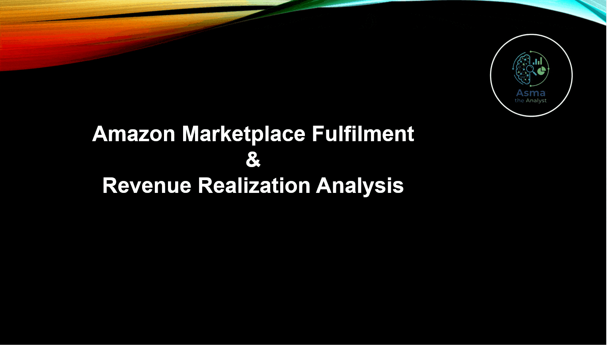
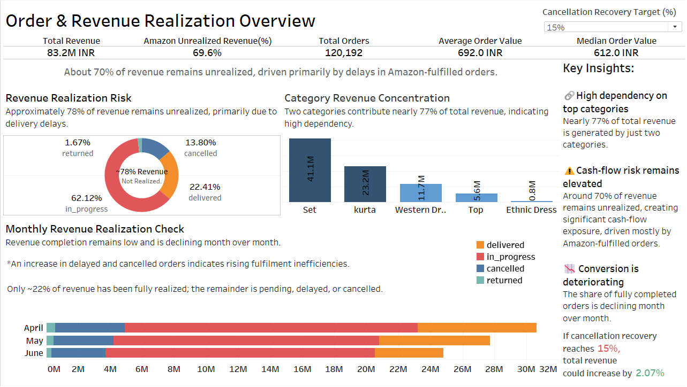
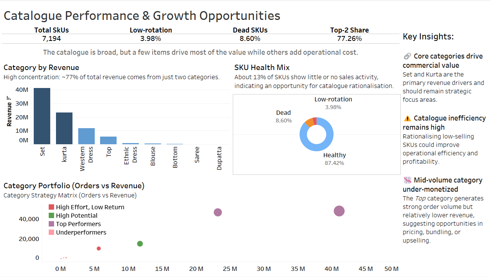
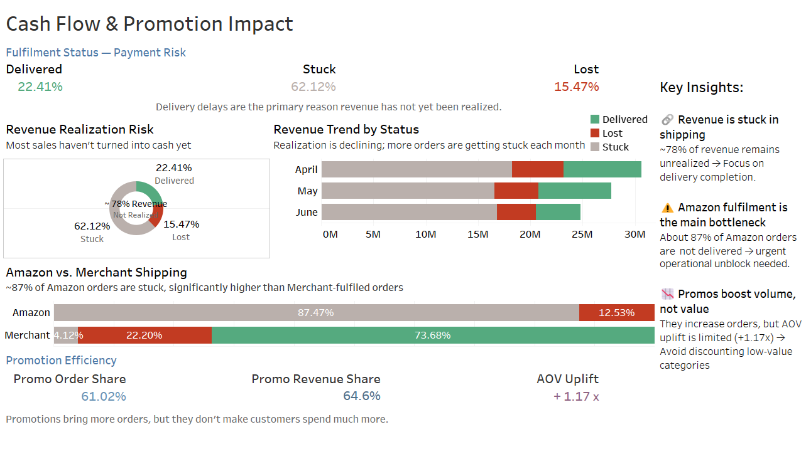

<div align = "justify">

# 📦 Amazon Marketplace Fulfilment & Revenue Realization Analysis 


### *Python Data Pipeline + Tableau Dashboards*

Operational Risk | Revenue Realization | Order-to-Cash Optimization


---



---

## 🔹 خلاصه فارسی (برای مدیران و کارفرمایان):

این پروژه یک تحلیل عملیاتی از وضعیت فروش بازارگاه آمازون است. یافته‌های اصلی نشان می‌دهد که با وجود تقاضای قوی (بیش از ۸۳ میلیون INR)، تحقق درآمد به دلیل مشکلات زنجیره تأمین و عملیات (Fulfilment) دچار چالش جدی است. این گزارش با تفکیک داده‌ها به مدیران نشان می‌دهد که مشکل اصلی «کمبود تقاضا» نیست، بلکه «شکست در اجرای سفارش‌ها» است و ارائه می‌دهد که چگونه با اولویت‌بندی عملیاتی می‌توان بخش بزرگی از درآمدِ از دست رفته را بازیابی کرد.

**Revenue exists, but cash is stuck.**
This analysis moves beyond simple sales reporting to identify exactly where the revenue realization process breaks down.

## 📸 Dashboards Overview

### 1️⃣ Order & Revenue Realization Overview

<div align = "center">



</div>

### 2️⃣ Catalogue Efficiency & Commercial Focus

<div align = "center">



</div>

### 3️⃣ Order‑to‑Cash Realization & Promotion Efficiency

<div align = "center">



</div>

---

## Business Problem & Objectives

Marketplace revenue is strong, but **revenue realization is weak**.
Fulfilment failures (cancellations, returns, delayed deliveries) prevent a large share of orders from turning into collected revenue.

Business Goal: **Increase cash flow by improving fulfilment execution and reducing unrealized Amazon revenue.**

---

## Business Questions
This analysis aims to answer three operational questions critical for marketplace performance:

- How much of the recorded revenue is actually realized as cash?
- Where in the order‑to‑cash process does revenue get stuck?
- Which operational actions can unlock the highest financial impact in the short term?

----

## Key Insights:

<div dir="ltr" align="center">
  <table style="width: 100%; border-collapse: collapse; text-align: left; border: 1px solid #ddd;">
    <thead>
      <tr style="background-color: #f2f2f2;">
        <th style="padding: 12px; border: 1px solid #ddd; width: 30%;">Insight</th>
        <th style="padding: 12px; border: 1px solid #ddd; width: 35%;">Meaning</th>
        <th style="padding: 12px; border: 1px solid #ddd; width: 35%;">Business Impact</th>
      </tr>
    </thead>
    <tbody>
      <tr>
        <td style="padding: 10px; border: 1px solid #ddd;">~70% of total revenue is unrealized</td>
        <td style="padding: 10px; border: 1px solid #ddd;">Orders are created but cash has not been collected due to delivery delays</td>
        <td style="padding: 10px; border: 1px solid #ddd;"><strong>Highest priority:</strong> Fix fulfilment execution to unlock trapped cash</td>
      </tr>
      <tr>
        <td style="padding: 10px; border: 1px solid #ddd;">Only 22.41% of orders are delivered</td>
        <td style="padding: 10px; border: 1px solid #ddd;">Very low order-to-cash conversion despite strong demand</td>
        <td style="padding: 10px; border: 1px solid #ddd;">Indicates weak operational performance, not a demand issue</td>
      </tr>
      <tr>
        <td style="padding: 10px; border: 1px solid #ddd;">Amazon-fulfilled orders show severe delivery delays</td>
        <td style="padding: 10px; border: 1px solid #ddd;">Amazon fulfilment is the main bottleneck in revenue realization</td>
        <td style="padding: 10px; border: 1px solid #ddd;">Fulfilment execution is the key operational risk</td>
      </tr>
      <tr>
        <td style="padding: 10px; border: 1px solid #ddd;">Merchant-fulfilled orders achieve 87.47% delivery rate</td>
        <td style="padding: 10px; border: 1px solid #ddd;">Alternative fulfilment performs significantly better</td>
        <td style="padding: 10px; border: 1px solid #ddd;">Opportunity to rebalance or hybridize fulfilment strategy</td>
      </tr>
      <tr>
        <td style="padding: 10px; border: 1px solid #ddd;">61% of orders use promotions</td>
        <td style="padding: 10px; border: 1px solid #ddd;">Sales volume is highly dependent on discounts</td>
        <td style="padding: 10px; border: 1px solid #ddd;">Revenue growth is promotion-driven, not organic</td>
      </tr>
      <tr>
        <td style="padding: 10px; border: 1px solid #ddd;">Promotions increase AOV by only 1.17×</td>
        <td style="padding: 10px; border: 1px solid #ddd;">Discounts boost conversion but not basket size</td>
        <td style="padding: 10px; border: 1px solid #ddd;">Promotions are inefficient for value creation</td>
      </tr>
      <tr>
        <td style="padding: 10px; border: 1px solid #ddd;">77.3% of revenue comes from Set & Kurta categories</td>
        <td style="padding: 10px; border: 1px solid #ddd;">Revenue is concentrated in two product categories</td>
        <td style="padding: 10px; border: 1px solid #ddd;"><strong>Strategic risk:</strong> High dependency; diversification needed</td>
      </tr>
      <tr>
        <td style="padding: 10px; border: 1px solid #ddd;">12.6% of SKUs are low-rotation or dead stock</td>
        <td style="padding: 10px; border: 1px solid #ddd;">Operational effort is spent on low-return products</td>
        <td style="padding: 10px; border: 1px solid #ddd;">Opportunity for catalogue rationalization and cost reduction</td>
      </tr>
      <tr>
        <td style="padding: 10px; border: 1px solid #ddd;">Monthly revenue realization is declining</td>
        <td style="padding: 10px; border: 1px solid #ddd;">Cash inflow is slowing over time</td>
        <td style="padding: 10px; border: 1px solid #ddd;">Short-term cash-flow risk is increasing</td>
      </tr>
    </tbody>
  </table>
</div>

---

## KPI Snapshot (Q2 2022)

- **Total Revenue:** 83.18M INR
- **Total Orders:** 120,192
- **Delivered Rate:** 22.41%
- **Cancellation Rate:** 13.8%
- **Returned Rate:** 1.67%
- **In-Progress Rate:** 62.12%
- **Unrealized Revenue (Amazon):** 57.9M INR (~69.6% of total revenue)

The majority of orders remain in-progress, explaining why a large share of recorded revenue has not yet been realized as cash.

---

## Strategic Actions

<div dir="ltr" align = "center">
  <table style="width: 100%; border-collapse: collapse; border: 1px solid #ddd;">
    <thead>
      <tr style="background-color: #f2f2f2;">
        <th style="padding: 12px; border: 1px solid #ddd; width: 45%; text-align: left;">Action</th>
        <th align="center" style="padding: 12px; border: 1px solid #ddd; width: 15%;">Impact</th>
        <th align="center" style="padding: 12px; border: 1px solid #ddd; width: 20%;">Effort</th>
        <th align="center" style="padding: 12px; border: 1px solid #ddd; width: 20%;">Priority</th>
      </tr>
    </thead>
    <tbody>
      <tr>
        <td style="padding: 10px; border: 1px solid #ddd; text-align: left;">Resolve Amazon fulfilment delays to improve order-to-cash conversion</td>
        <td align="center" style="padding: 10px; border: 1px solid #ddd;">High</td>
        <td align="center" style="padding: 10px; border: 1px solid #ddd;">Medium</td>
        <td align="center" style="padding: 10px; border: 1px solid #ddd;">High</td>
      </tr>
      <tr>
        <td style="padding: 10px; border: 1px solid #ddd; text-align: left;">Reduce cancellation rate (13.8%) through fulfilment and order management improvements</td>
        <td align="center" style="padding: 10px; border: 1px solid #ddd;">High</td>
        <td align="center" style="padding: 10px; border: 1px solid #ddd;">Medium</td>
        <td align="center" style="padding: 10px; border: 1px solid #ddd;">High</td>
      </tr>
      <tr>
        <td style="padding: 10px; border: 1px solid #ddd; text-align: left;">Remove the bottom 12.6% low-rotation or dead SKUs to simplify the catalogue</td>
        <td align="center" style="padding: 10px; border: 1px solid #ddd;">Medium</td>
        <td align="center" style="padding: 10px; border: 1px solid #ddd;">Low</td>
        <td align="center" style="padding: 10px; border: 1px solid #ddd;">High</td>
      </tr>
      <tr>
        <td style="padding: 10px; border: 1px solid #ddd; text-align: left;">Refocus promotions on strategic products and underdeveloped categories</td>
        <td align="center" style="padding: 10px; border: 1px solid #ddd;">Medium</td>
        <td align="center" style="padding: 10px; border: 1px solid #ddd;">Medium</td>
        <td align="center" style="padding: 10px; border: 1px solid #ddd;">Medium</td>
      </tr>
      <tr>
        <td style="padding: 10px; border: 1px solid #ddd; text-align: left;">Use merchant-fulfilled orders as a benchmark for operational performance</td>
        <td align="center" style="padding: 10px; border: 1px solid #ddd;">Medium</td>
        <td align="center" style="padding: 10px; border: 1px solid #ddd;">Low</td>
        <td align="center" style="padding: 10px; border: 1px solid #ddd;">Medium</td>
      </tr>
      <tr>
        <td style="padding: 10px; border: 1px solid #ddd; text-align: left;">Treat fulfilment performance as a key driver of cash flow and operational KPI</td>
        <td align="center" style="padding: 10px; border: 1px solid #ddd;">High</td>
        <td align="center" style="padding: 10px; border: 1px solid #ddd;">Medium</td>
        <td align="center" style="padding: 10px; border: 1px solid #ddd;">High</td>
      </tr>
    </tbody>
  </table>
</div>
	
---

## Expected Business Impact (Scenario)

If fulfilment execution improves and cancellation recovery reaches **15%**,  
total realized revenue could increase by approximately **2–3% in the short term**.

This impact is driven primarily by faster order‑to‑cash conversion and reduced revenue loss from cancelled and delayed Amazon‑fulfilled orders.

---

## Analytical Highlights (What the Data Says)

- **Realization Risk:** Realization declines month-by-month; merchant-fulfilled orders are significantly more reliable than Amazon-fulfilled ones.
- **Catalogue Waste:** 12.6% of the catalogue is “dead” inventory. Rationalizing this will reduce operational load.
- **Promotion Efficiency:** Promotions increase order volume significantly, but fail to increase customer value (AOV uplift only 1.17×). We recommend shifting toward value-based pricing.

---

## Tools & Skills Demonstrated

<div dir="ltr" align="center">
  <table style="width: 100%; border-collapse: collapse; text-align: left; border: 1px solid #ddd;">
    <thead>
      <tr style="background-color: #f2f2f2;">
        <th style="padding: 12px; border: 1px solid #ddd; width: 30%;">Area</th>
        <th style="padding: 12px; border: 1px solid #ddd; width: 70%;">Implementation</th>
      </tr>
    </thead>
    <tbody>
      <tr>
        <td style="padding: 10px; border: 1px solid #ddd;">Python</td>
        <td style="padding: 10px; border: 1px solid #ddd;">pandas, numpy, matplotlib, seaborn</td>
      </tr>
      <tr>
        <td style="padding: 10px; border: 1px solid #ddd;">Data Engineering</td>
        <td style="padding: 10px; border: 1px solid #ddd;">Standardized cleaning, imputation, and status mapping</td>
      </tr>
      <tr>
        <td style="padding: 10px; border: 1px solid #ddd;">Analytical Modeling</td>
        <td style="padding: 10px; border: 1px solid #ddd;">Unrealized revenue frameworks & SKU health classification</td>
      </tr>
      <tr>
        <td style="padding: 10px; border: 1px solid #ddd;">BI & Viz</td>
        <td style="padding: 10px; border: 1px solid #ddd;">Tableau dashboards for operational risk & category focus</td>
      </tr>
      <tr>
        <td style="padding: 10px; border: 1px solid #ddd;">Business Impact</td>
        <td style="padding: 10px; border: 1px solid #ddd;">Converting raw data into a “Cash-Flow Protection” strategy</td>
      </tr>
    </tbody>
  </table>
</div>

---

## Project Structure

```text
Amazon_Marketplace_Analysis/
├─ Data/
│   └─ Amazon_Sales_Report.xlsx
├─ Docs/
│   └─ data_quality_report.md
├─ Executive_Summary/
│   ├─ Amazon_Marketplace_Insights_and_Recommendations.pdf
│   └─ Amazon_Marketplace_Insights_and_Recommendations_FA.pdf
├─ Images/
│   ├─ dashboard1_order_revenue.png
│   ├─ dashboard2_catalogue_performance.png
│   ├─ dashboard3_cash_flow.png
│   ├─ Amazon_Analysis_Animation.gif
│   └─ logo.png
├─ Results/
│   ├─ cleaned_data.csv
│   ├─ kpi_summary.csv
│   └─ sku_performance.csv
├─ Scripts/
│   ├─ data_quality_report.py
│   ├─ cleaning.py
│   └─ analysis.py
├─ Dashboards/
│   └─ Amazon_Marketplace_Fulfilment.twbx  # Tableau workbook
├─ README.md
└─ README_FA.md
```

---

## How to Run

### Run Data Pipeline (Python)
```bash
python Scripts/cleaning.py --input Data/Amazon_Sales_Report.xlsx --output Results/cleaned_data.csv
python Scripts/analysis.py --input Results/cleaned_data.csv --output_dir Results
```

#### Pipeline Outputs:

- `Results/cleaned_data.csv` – analysis‑ready dataset  
- `Results/kpi_summary.csv` – KPI table used in dashboards  
- `Results/sku_performance.csv` – SKU health & ranking for catalogue views  

### Using the Tableau Dashboards
The dashboards automatically read from the files generated by the Python pipeline.

1. Open `Dashboards/Amazon_Marketplace_Fulfilment.twbx` in **Tableau Desktop**.  
2. Ensure the workbook is pointing to the local data files:
   - `Results/kpi_summary.csv`
   - `Results/sku_performance.csv`  
   (The workbook expects the same folder structure used in this repository.)
3. Navigate across the three dashboards using the built‑in tabs:
   - **Order & Revenue Analysis**
   - **Catalogue Performance**
   - **Cash Flow & Revenue Realization**
4. Explore fulfilment outcomes, promotion usage, and SKU‑level performance.

These dashboards are designed so that a **non‑technical stakeholder** can quickly answer questions such as:

- How much money are we really making?
- Where exactly is revenue getting stuck?  
- Which SKUs should be expanded, improved, or removed?

---

## 🗃 Dataset

- **Source:** Public Amazon sales export from data.world  
  *(original file not redistributed due to access restrictions)*
- **Records:** ~129k
- **Columns:** `order_id`, `date`, `order_status`, `fulfilment`, `sku`, `category`, `amount`, `qty`, `promotion_ids`, `b2b`
---

## 📁 Deliverables

👉 **Executive Summary ([PDF – English](Executive_Summary/Amazon_Marketplace_Fulfilment_and_Revenue_Realization_Analysis_Insights_and_Recommendations.pdf)):**  Structured overview of demand, fulfilment performance, revenue realization risks, and recommended operational actions.

👉 **Executive Summary ([PDF – Persian](Executive_Summary/Amazon_Marketplace_Fulfilment_and_Revenue_Realization_Analysis_Insights_and_Recommendations_FA.pdf)):** Persian version of the executive summary.

👉 **Dashboard Walkthrough (GIF) ([Dashboard Walkthrough – GIF](Images/Amazon_Analysis_Animation.gif)):** An interactive walkthrough showcasing the Order-to-Cash process and real-time revenue impact analysis.

---

## 👤 Author

**Asma Sistani – Data Analyst**  
Turning operational complexity into clear, commercially relevant insight.

💻 **GitHub:** [](https://github.com/asma-sistani)

🔗 **LinkedIn:** [](https://www.linkedin.com/in/asma-sistani)

🌐 **Portfolio:** [](https://asmatheanalyst.github.io/portfolio.html)

---

**This project demonstrates the transition from “what happened” to “what we should do” — focusing on revenue realization rather than just order volume.**

----

</div>